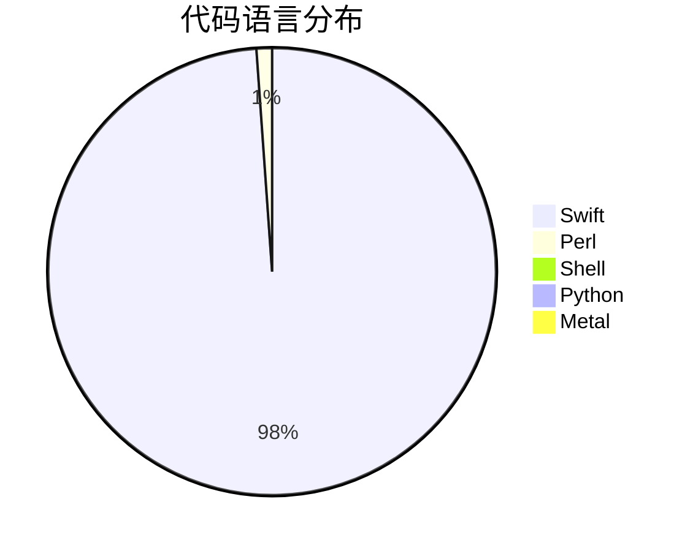
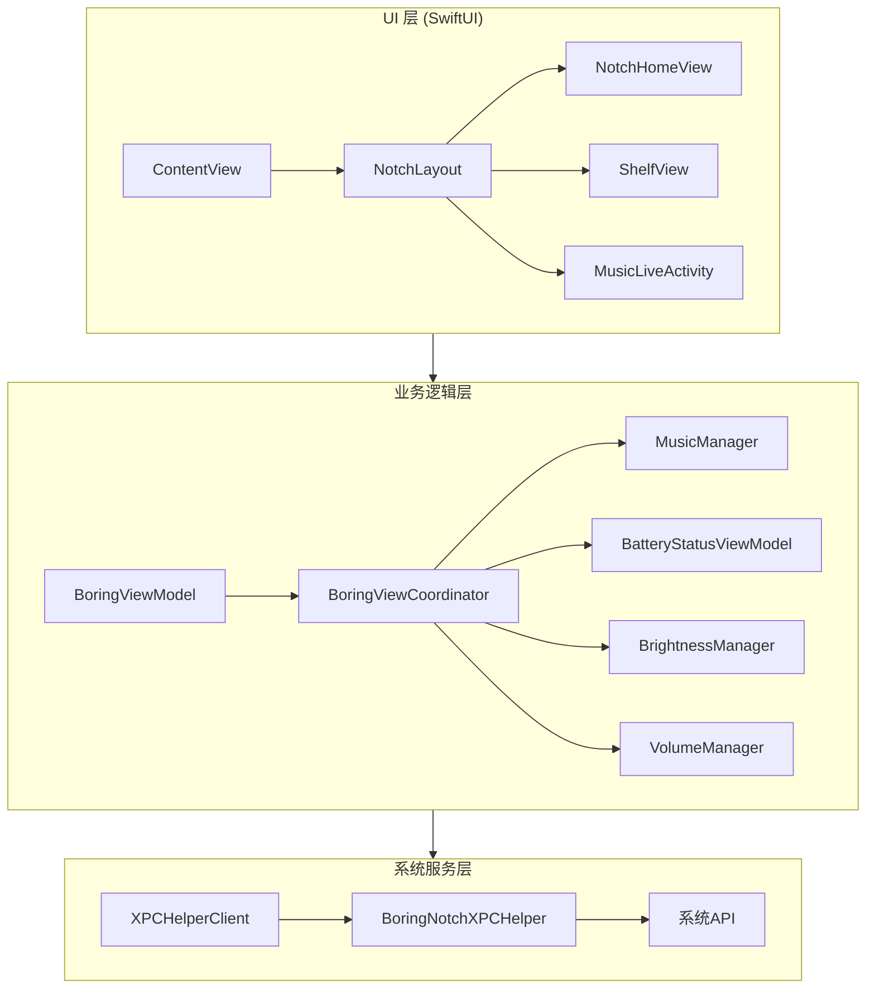
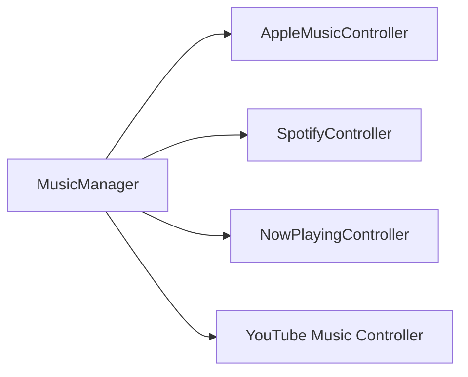
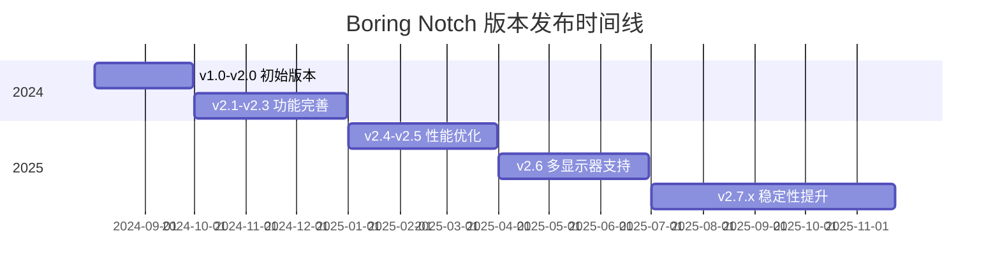
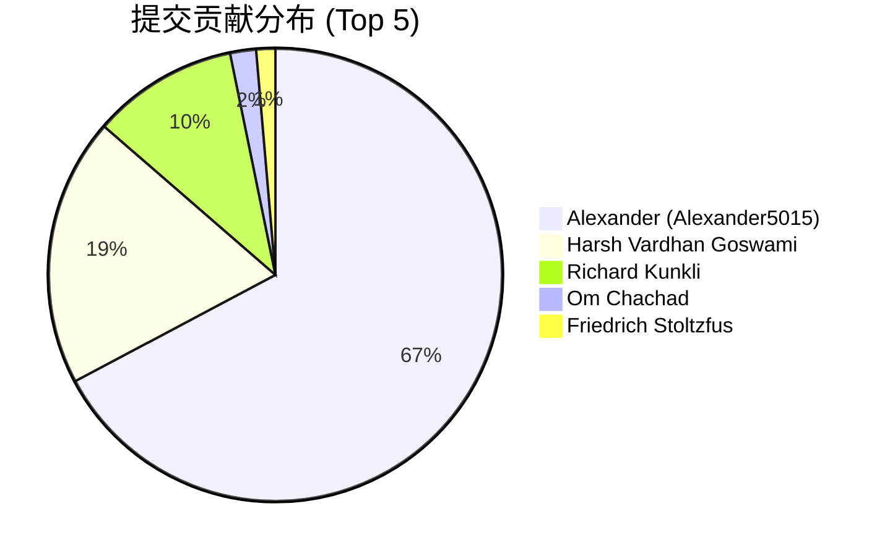

# Boring Notch 深度研究报告

**研究日期：** 2026-03-02  
**置信度：** 高 (90%+)  
**研究对象：** [TheBoredTeam/boring.notch](https://github.com/TheBoredTeam/boring.notch)

---

## 执行摘要

**Boring Notch** 是一款专为 macOS 设计的开源应用，将 MacBook 的刘海区域转变为动态的多功能控制中心。项目自 2024 年 8 月创建以来，已获得 **7,390+ Stars**、**519 Forks**，拥有 **47 位贡献者**，累计 **1,180+ 次提交**，发布了 **15 个版本**（最新 v2.7.3）。项目采用 **Swift/SwiftUI** 技术栈，遵循 **GPL-3.0** 开源协议。

---

## 项目概览

### 核心指标

| 指标 | 数值 |
|------|------|
| ⭐ Stars | 7,390 |
| 🍴 Forks | 519 |
| 🐛 Open Issues | 207 |
| 👥 Contributors | 47 |
| 📝 Total Commits | 1,180+ |
| 🏷️ Releases | 15 |
| 📦 Latest Version | v2.7.3 (Flying Rabbit 🐇🪽) |
| 📅 Created | 2024-08-02 |
| 🔄 Last Updated | 2026-03-02 |

### 技术栈分布



---

## 功能特性

### 已实现功能 ✅

| 功能 | 描述 |
|------|------|
| 🎧 音乐播放控制 | 支持 Apple Music、Spotify、YouTube Music，带动态可视化频谱 |
| 📆 日历集成 | 实时显示日历事件 |
| ☑️ 提醒事项集成 | 与系统提醒事项同步 |
| 📷 摄像头预览 | 实时摄像头画面显示 |
| 🔋 充电指示器 | 显示电池状态和充电百分比 |
| 👆🏻 手势控制 | 可自定义的手势操作 |
| 📚 文件架 (Shelf) | 支持 AirDrop 的文件拖放功能 |
| 🖥️ 多显示器支持 | 可在不同尺寸显示器上自定义 |
| 🎚️💡⌨️ 系统 HUD 替换 | 替换音量、亮度、键盘背光 HUD |
| 🎵 歌词显示 | 同步滚动歌词功能 |

### 规划中功能 📋

- 🔵 蓝牙设备连接/断开活动
- ⛅️ 天气集成
- 🛠️ 自定义布局选项
- 🔒 锁屏小组件
- 🧩 扩展系统
- 🔔 通知功能（考虑中）

---

## 技术架构

### 整体架构图



### 核心组件

#### 1. 窗口管理系统

`BoringNotchWindow` 类创建浮动透明面板，位于菜单栏之上：

```swift
class BoringNotchWindow: NSPanel {
    override init(...) {
        isFloatingPanel = true
        isOpaque = false
        backgroundColor = .clear
        level = .mainMenu + 3
    }
}
```

#### 2. XPC 服务架构

采用 XPC 服务实现安全的系统级功能访问：

- **辅助功能权限管理**
- **屏幕亮度控制**
- **键盘背光调节**
- **媒体播放控制**

#### 3. 音乐控制器

支持多平台音乐控制：



### 项目结构

```
boring.notch/
├── boringNotch/
│   ├── boringNotchApp.swift      # 应用入口
│   ├── ContentView.swift         # 主视图
│   ├── BoringViewCoordinator.swift # 视图协调器
│   ├── MediaControllers/         # 媒体控制器
│   ├── components/               # UI 组件
│   │   ├── Music/               # 音乐相关组件
│   │   ├── Calendar/            # 日历组件
│   │   ├── Shelf/               # 文件架组件
│   │   ├── Settings/            # 设置界面
│   │   └── Notch/               # 刘海相关组件
│   ├── managers/                 # 系统管理器
│   └── Providers/               # 数据服务提供者
├── BoringNotchXPCHelper/        # XPC 助手服务
└── Configuration/               # 配置文件
```

---

## 版本演进时间线



### 主要版本里程碑

| 版本 | 日期 | 主要更新 |
|------|------|----------|
| v2.7.3 | 2025-11-24 | Flying Rabbit 🐇🪽 - 最新稳定版 |
| v2.7 | 2025-10 | HUD 改进、辅助功能监控 |
| v2.6 | 2025-06 | 多显示器支持增强 |
| v2.5 | 2025-01-14 | Jellyfin Snoring - 内存泄漏修复、手势优化 |
| v2.3 | 2024-12 | 快捷键支持、日历改进 |
| v2.0 | 2024-09 | 重大架构重构 |

---

## 贡献者分析

### 核心贡献者



| 贡献者 | 提交数 | 角色 |
|--------|--------|------|
| Alexander (Alexander5015) | 691 | 主要维护者 |
| Harsh Vardhan Goswami | 197 | 项目创始人 |
| Richard Kunkli | 107 | 核心贡献者 |
| Om Chachad | 19 | 功能贡献者 |
| Friedrich Stoltzfus | 14 | 功能贡献者 |

---

## 社区与生态

### 社区资源

- **Discord 服务器：** [Boring Notch Discord](https://discord.gg/c8JXA7qrPm)
- **官方网站：** [theboring.name](https://theboring.name)
- **本地化平台：** [Crowdin](https://crowdin.com/project/boring-notch)
- **赞助支持：** [Ko-fi](https://www.ko-fi.com/alexander5015)

### 安装方式

#### 手动安装
```bash
# 下载 DMG 后执行
xattr -dr com.apple.quarantine /Applications/boringNotch.app
```

#### Homebrew 安装
```bash
brew install --cask TheBoredTeam/boring-notch/boring-notch --no-quarantine
```

### 系统要求

- **macOS 14 Sonoma** 或更高版本
- Apple Silicon 或 Intel Mac
- Xcode 16+（从源码构建）

---

## 竞品对比

| 功能 | Boring Notch | NotchDrop | 其他工具 |
|------|--------------|-----------|----------|
| 音乐控制 | ✅ 完整支持 | ❌ | 部分支持 |
| 文件管理 | ✅ Shelf 功能 | ✅ | ❌ |
| 日历集成 | ✅ 实时显示 | ❌ | ❌ |
| 摄像头预览 | ✅ | ❌ | ❌ |
| 系统 HUD 替换 | ✅ 完全替代 | ❌ | 部分支持 |
| 开源 | ✅ GPL-3.0 | ✅ | 部分 |
| 价格 | 免费 | 免费 | 免费/付费 |

---

## 优势与挑战

### 优势 💪

1. **功能全面** - 一个工具满足多种需求
2. **开源免费** - GPL-3.0 协议，社区驱动
3. **活跃维护** - 持续更新，响应用户反馈
4. **深度系统集成** - SwiftUI + XPC 架构
5. **多平台音乐支持** - Apple Music、Spotify、YouTube Music
6. **国际化支持** - Crowdin 本地化平台

### 挑战 ⚠️

1. **初次配置复杂** - 需要绕过 macOS 安全检查
2. **资源占用** - 相比基础工具略高
3. **无 Apple 开发者签名** - 需要手动信任应用
4. **207 个 Open Issues** - 待解决问题较多

---

## 技术亮点

### 1. 现代化 SwiftUI 架构

- 声明式 UI 语法
- 响应式数据流（@Published + ObservableObject）
- Combine 框架管理数据流

### 2. 安全的系统集成

- XPC 服务沙盒隔离
- 辅助功能权限安全访问
- 系统硬件控制封装

### 3. 性能优化

- 懒加载机制
- 内存管理优化
- TimelineView 动画性能优化

### 4. 模块化设计

- 高度解耦的组件架构
- 插件化设计预留
- 配置驱动的功能定制

---

## 未来展望

根据 Roadmap 和社区讨论，项目未来可能的发展方向：

1. **扩展系统** - 支持第三方插件
2. **天气集成** - 显示天气信息
3. **蓝牙设备管理** - 设备连接状态显示
4. **锁屏小组件** - 锁屏界面功能扩展
5. **通知系统** - 系统通知集成

---

## 研究方法

本报告采用以下研究方法：

1. **GitHub API 数据采集** - 获取项目元数据、贡献者、发布信息
2. **源代码分析** - 深入分析核心代码架构
3. **网络搜索** - 收集评测文章和社区讨论
4. **Git 历史分析** - 追踪版本演进和功能发展

---

## 参考资料

### 官方资源
- [GitHub 仓库](https://github.com/TheBoredTeam/boring.notch)
- [官方网站](https://theboring.name)
- [Discord 社区](https://discord.gg/c8JXA7qrPm)

### 技术文章
- [Boring Notch 架构剖析：SwiftUI 与 macOS 系统集成的艺术](https://blog.csdn.net/gitblog_00772/article/details/154675720)
- [2024年最佳MacBook刘海工具深度评测](https://blog.csdn.net/gitblog_00258/article/details/156504818)

### 相关项目
- [NotchDrop](https://github.com/Lakr233/NotchDrop) - Shelf 功能灵感来源
- [MediaRemoteAdapter](https://github.com/ungive/mediaremote-adapter) - macOS 15.4+ Now Playing 支持

---

## 置信度评估

| 信息类别 | 置信度 | 来源 |
|----------|--------|------|
| 项目指标 | 高 (95%) | GitHub API |
| 技术架构 | 高 (90%) | 源代码分析 |
| 版本历史 | 高 (95%) | Git 历史 |
| 功能特性 | 高 (90%) | README + 代码 |
| 社区评价 | 中 (75%) | 网络搜索 |
| 未来规划 | 中 (70%) | Roadmap + Issues |

---

*报告生成时间：2026-03-02*  
*研究工具：GitHub API、Git、Web Search*
